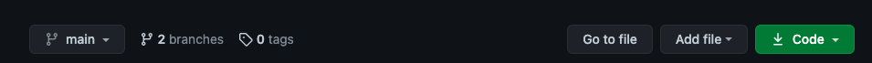

# _{Application Name}_

#### _{Brief description of application}_

#### By _**{List of contributors}**_

## Technologies Used

* _List all_
* _the major technologies_
* _you used in your project_
* _here_

## Description

_{This is a detailed description of your application. Give as much detail as needed to explain what the application does as well as any other information you want users or other developers to have.}_

## Setup/Installation Requirements

* _Clone this repository. To clone using HTTPS, click on the green download button above the list of files and click on the clipboard icon to save the repository URL._

* _Open your terminal._
* _Navigate to the directory (such as your Desktop) where you want the cloned directory._
* _Type `git clone` and paste the URL you copied._
* _Press Enter._
* _Navigate to the project folder on your computer and open the `index.html` file to view the webpage._
* _Alternatively, you can view the live webpage via this [GitHub Page](https://webquiza.github.io/practice_css_bootstrap_2/)._

## Known Bugs

* _Any known issues_
* _should go here_

## License

_{Let people know what to do if they run into any issues or have questions, ideas or concerns.  Encourage them to contact you or make a contribution to the code.}_

## Contact Information

_{Add your contact information here.}_